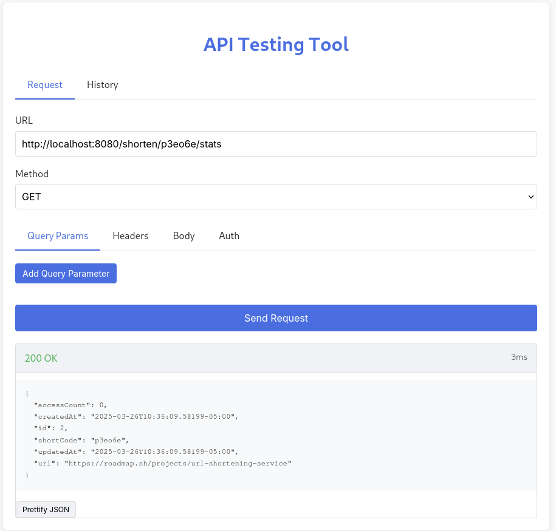

# URL Shortener API

A simple RESTful API for creating and managing shortened URLs.



## Project URL
[Project URL](https://roadmap.sh/projects/url-shortening-service)

## Table of Contents
- [Overview](#overview)
- [Installation](#installation)
- [API Endpoints](#api-endpoints)
- [Request & Response Examples](#request--response-examples)
- [Error Codes](#error-codes)

## Overview

This API allows you to:
- Create shortened URLs from long URLs
- Retrieve the original URL using a shortcode
- Update existing shortened URLs
- Delete shortened URLs
- View usage statistics for shortened URLs

## Installation

### Prerequisites
- Go 1.16+
- PostgreSQL 12+

### Setup

1. Clone the repository
```
git clone https://github.com/yourusername/url-shortener.git
cd url-shortener
```

2. Create a `.env` file in the project root directory
```
DB_HOST=localhost
DB_PORT=5432
DB_USER=postgres
DB_PASSWORD=your_password
DB_NAME=url_shortener
DB_SSLMODE=disable
```

3. Run database migrations

4. Build and run the service
```
go build -o url-shortener
./url-shortener
```

The service will start on port 8080 by default.

## API Endpoints

| Method | Endpoint | Description |
|--------|----------|-------------|
| GET | `/ping` | Health check endpoint |
| POST | `/shorten` | Create a new shortened URL |
| GET | `/shorten/:shortcode` | Retrieve the original URL |
| PUT | `/shorten/:shortcode` | Update an existing shortened URL |
| DELETE | `/shorten/:shortcode` | Delete a shortened URL |
| GET | `/shorten/:shortcode/stats` | Get usage statistics for a shortened URL |

## Request & Response Examples

### Create a shortened URL

**Request:**
```http
POST /shorten
Content-Type: application/json

{
  "url": "https://example.com/very/long/url/that/needs/shortening"
}
```

**Response:**
```json
{
  "id": 1,
  "url": "https://example.com/very/long/url/that/needs/shortening",
  "shortCode": "ab13cd",
  "createdAt": "2023-05-15T14:30:45Z",
  "updatedAt": "2023-05-15T14:30:45Z"
}
```

### Retrieve original URL

**Request:**
```http
GET /shorten/ab13cd
```

**Response:**
```json
{
  "id": 1,
  "url": "https://example.com/very/long/url/that/needs/shortening",
  "shortCode": "ab13cd",
  "createdAt": "2023-05-15T14:30:45Z",
  "updatedAt": "2023-05-15T14:30:45Z"
}
```

### Update a shortened URL

**Request:**
```http
PUT /shorten/ab13cd
Content-Type: application/json

{
  "url": "https://new-example.com/updated/url"
}
```

**Response:**
```json
{
  "id": 1,
  "url": "https://new-example.com/updated/url",
  "shortCode": "ab13cd",
  "createdAt": "2023-05-15T14:30:45Z",
  "updatedAt": "2023-05-15T15:20:18Z"
}
```

### Delete a shortened URL

**Request:**
```http
DELETE /shorten/ab13cd
```

**Response:**
```json
{
  "message": "successfully deleted"
}
```
Status code: 204

### Get URL statistics

**Request:**
```http
GET /shorten/ab13cd/stats
```

**Response:**
```json
{
  "id": 1,
  "url": "https://example.com/very/long/url/that/needs/shortening",
  "shortCode": "ab13cd",
  "createdAt": "2023-05-15T14:30:45Z",
  "updatedAt": "2023-05-15T15:20:18Z",
  "accessCount": 42
}
```

## Error Codes

| Status Code | Description |
|-------------|-------------|
| 200 | Success |
| 201 | Resource created/updated successfully |
| 204 | Resource deleted successfully |
| 300 | Invalid request (malformed JSON, invalid URL) |
| 404 | Resource not found |
| 500 | Internal server error |

